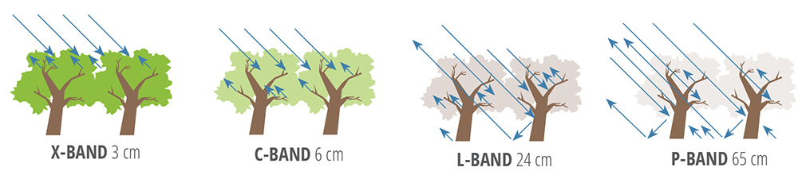

# 🛰️ P-Band SAR & The ESA BIOMASS Mission

### The First P-Band Radar in Space — A Hands-On Research Lab

 

 

*Built after attending ESA's official webinar:*
***"ESA P-band SAR Mission Status — One Year After Launch"***

 

[The Story](#-the-story-behind-this) · [The Science](#-what-is-p-band-radar) · [BIOMASS Mission](#-the-esa-biomass-mission) · [5 Missions](#-the-5-missions) · [Quick Start](#-quick-start) · [Resources](#-resources--datasets) · [Cite This Work](#-citation)

 

---

 

## 💫 The Story Behind This

It started with **space watches, rocket t-shirts, glow-in-the-dark planet stickers**, and bedtime books about astronauts.

My kids fell in love with space. They wanted to know how satellites work, what they see from up there, and whether we can really look *through* a forest from orbit. Their curiosity was relentless — and contagious.

So I did what any parent would do: **I started learning for them.**

I attended ESA's official webinar on the BIOMASS mission — the first P-band radar satellite ever launched into space. I took notes. I dug into the data. I wrote code. And somewhere along the way, I realized this wasn't just for my kids anymore — **this could help students, researchers, and anyone curious about how we observe our planet from space.**

This repository is the result: a hands-on learning lab built from genuine curiosity, real satellite data, and a father's promise to turn his children's wonder into something the whole world can learn from.

 

> *🚀 Dedicated to my children — whose space watches and rocket stickers*
> *started a journey that led all the way to real satellite data from orbit.*
>
> *May your curiosity never stop reaching for the stars.*

 

---

 

## 📡 What is P-Band Radar?

The **P-band** refers to the lower-frequency portion of the electromagnetic spectrum used by radar satellites. It operates at **435 MHz** with a wavelength of **~70 cm** — the longest wavelength SAR ever sent to space.

Unlike traditional X-band or C-band radars that bounce off the tops of trees, P-band's long wavelength gives it a unique superpower: **penetration**. It can see straight through leaves and branches to the trunks, the forest floor, and even deep underground.

 

 
<em>SAR band penetration comparison — longer wavelengths penetrate deeper into vegetation and ground.</em>

 

<pre>
     What C-Band Sees                    What P-Band Sees
     (Sentinel-1, 5.6 cm)               (BIOMASS, 70 cm)

     ══════════════════════          ══════════════════════
     📡 Radar Signal                 📡 Radar Signal
          │                               │
          ▼                               ▼
     🌿🌿🌿🌿🌿🌿🌿🌿🌿          🌿🌿🌿│🌿🌿🌿🌿🌿
     ─── REFLECTS HERE ───               │ PASSES THROUGH
     ❌ Cannot see below                  ▼
                                    🌲🌲🌲│🌲🌲🌲🌲🌲
                                     Tree │ Trunks
                                          ▼
                                    ══════════════════════
                                    🏔️ Ground / Subsurface
                                    ✅ Full forest structure
</pre>

 

### Penetration Capabilities

| Capability | What P-Band Reveals | Why It Matters |
|:-----------|:--------------------|:---------------|
| 🌳 **Forest Penetration** | Sees through canopy to trunks and ground | Measures actual wood mass = carbon stored |
| 🏜️ **Sand Penetration** | Reveals structures buried 1–5 meters deep | Discovers ancient rivers, archaeological sites |
| 🧊 **Ice Penetration** | Maps internal layers of ice sheets | Tracks ice dynamics and climate history |
| 🌾 **Soil Moisture** | Senses moisture in deeper soil layers | Improves agricultural and drought monitoring |

 

### How It Compares to Other SAR Bands

| Band | Frequency | Wavelength | Penetration | Satellite Example |
|:-----|:----------|:-----------|:------------|:------------------|
| **X-band** | 9.6 GHz | 3.1 cm | Surface only | TerraSAR-X |
| **C-band** | 5.4 GHz | 5.6 cm | Top of canopy | Sentinel-1 |
| **L-band** | 1.3 GHz | 23 cm | Upper canopy | ALOS-2 PALSAR |
| **P-band** | 435 MHz | **70 cm** | **Full canopy + ground + subsurface** | **ESA BIOMASS** ✨ |

 

---

 

## 🌍 The ESA BIOMASS Mission

<table>
<tr>
<td width="55%">

**Launched:** April 2025
**Status:** Operational — delivering first science results
**Historic first:** The first P-band SAR satellite ever sent to space

BIOMASS answers one of the most critical questions in climate science:

> ***"Exactly how much carbon are Earth's forests storing — and how fast is that changing?"***

By measuring the actual wood mass in every forest on the planet, scientists can calculate global carbon stocks with unprecedented accuracy. When forests burn or get cleared, BIOMASS detects the change and quantifies the carbon released.

</td>
<td width="45%">

| Specification | Detail |
|:---|:---|
| **Frequency** | 435 MHz (P-band) |
| **Wavelength** | ~70 cm |
| **Orbit** | 666 km, Sun-synchronous |
| **Resolution** | 50–200 m |
| **Revisit** | 25 days |
| **Mission Life** | 5+ years |
| **Data Access** | Free & Open |

</td>
</tr>
</table>

 

### Key Applications & Early Insights

- 🌳 **Forest Biomass Mapping** — Measure wood mass globally to calculate carbon storage
- 🏜️ **Subsurface Imaging** — Penetrate dry sand to reveal buried rivers and archaeological sites
- 🧊 **Ice Sheet Mapping** — See internal structure of glaciers and ice dynamics
- 🗺️ **Topographic Mapping** — Generate elevation models via polarimetric interferometry
- 🔥 **Deforestation Detection** — Quantify carbon released when forests are cleared or burned

 

### Data Processing Pipeline

<pre>
📡 Satellite Acquisition
    │
    ▼
┌─────────────────────────────────────────────────────────────┐
│  Level 0    Raw instrument data (downlinked from satellite) │
└─────────────────────┬───────────────────────────────────────┘
                      ▼
┌─────────────────────────────────────────────────────────────┐
│  Level 1    Calibrated SAR images (backscatter, phase)      │
│             ├── SLC  (Single Look Complex)                  │
│             └── GRD  (Ground Range Detected)                │
└─────────────────────┬───────────────────────────────────────┘
                      ▼
┌─────────────────────────────────────────────────────────────┐
│  Level 2    Science Products (processed by BioPAL)          │
│             ├── 🌳 Forest Height Maps                       │
│             ├── 📊 Above Ground Biomass (AGB) in t/ha      │
│             ├── 🔥 Forest Disturbance / Deforestation       │
│             └── 🗺️ Digital Elevation Models                 │
└─────────────────────────────────────────────────────────────┘
                      ▼
              🔬 Your Research Starts Here
</pre>

 

---

 

## 🎯 The 5 Missions

> **The rule:** No notebook ends with just text. Every mission produces a map, a chart, a carbon estimate, or a trained model.

Each mission is a **Jupyter Notebook** with real data, working code, and a tangible output.

 

| # | Mission | What You Build | Difficulty | Time |
|:-:|:--------|:---------------|:-----------|:-----|
| 01 | [**Your First SAR Image**](01-your-first-sar-image/) | Download ESA data and create your first SAR visualization | 🟢 Beginner | 30 min |
| 02 | [**BIOMASS Data Explorer**](02-biomass-data-explorer/) | Compare P-band vs C-band — see the penetration difference | 🟡 Intermediate | 1 hr |
| 03 | [**Forest Carbon Calculator**](03-forest-carbon-calculator/) | Estimate carbon stock for any region on Earth | 🟡 Intermediate | 1.5 hrs |
| 04 | [**Subsurface Detective**](04-subsurface-detective/) | Reveal ancient rivers and structures hidden under desert sand | 🟠 Advanced | 2 hrs |
| 05 | [**ML SAR Classifier**](05-ml-sar-classifier/) | Train a deep learning model to classify land cover from radar | 🔴 Advanced | 3 hrs |

 

### What You Walk Away With

<pre>
Mission 1  →  📸  A real SAR image you processed yourself
Mission 2  →  📊  Side-by-side proof of why wavelength matters
Mission 3  →  📋  A carbon stock report with map (thesis-ready)
Mission 4  →  🗺️  A subsurface feature map revealing hidden geology
Mission 5  →  🤖  A trained ML model with evaluation metrics (portfolio-ready)
</pre>

 

### The Learning Path

<pre>
            🟢 BEGINNER                   🟡 INTERMEDIATE                   🟠🔴 ADVANCED
       ┌─────────────────┐          ┌──────────────────────┐          ┌─────────────────────┐
       │                 │          │                      │          │                     │
       │   Mission 1    │────▶     │  Mission 2           │────▶    │  Mission 4          │
       │   First SAR    │          │  P-band vs C-band    │          │  Subsurface         │
       │   Image        │          │                      │          │  Detection          │
       │                 │          │                      │          │                     │
       └─────────────────┘          │  Mission 3           │          │  Mission 5          │
                                    │  Carbon Calculator   │────▶    │  ML Classifier      │
                                    │                      │          │                     │
                                    └──────────────────────┘          └─────────────────────┘

       ⏱️ 30 minutes                ⏱️ 1 – 1.5 hours                 ⏱️ 2 – 3 hours
       📦 rasterio, matplotlib      📦 + geopandas                   📦 + scipy, pytorch
</pre>

 

### Who Is This For?

<table>
<tr>
<td width="33%" align="center">
<h4>🎓 Students</h4>

Start at Mission 1. No prior SAR knowledge needed. You'll have a portfolio piece by Mission 3.

</td>
<td width="33%" align="center">
<h4>🔬 Researchers</h4>

Jump to Mission 3 or 4. Real data, real methods, reproducible workflows for your papers.

</td>
<td width="33%" align="center">
<h4>👩‍🏫 Faculty</h4>

Use missions as lab exercises. Each is 30 min – 3 hrs, self-contained, with clear learning objectives.

</td>
</tr>
</table>

 

---

 

## 🚀 Quick Start

### Prerequisites

- **Python 3.11+** with Conda or Docker
- **Free ESA account** — [Register here](https://earth.esa.int/eogateway) (takes 2 minutes)
- **Git** installed on your machine

 

### Option A: Conda (Recommended)

    git clone https://github.com/BuildingTHEITGUY/building-the-it-guy-mentorship.git
    cd building-the-it-guy-mentorship/P-Band

    cd 00-setup
    conda env create -f environment.yml
    conda activate p-band-sar

    cd ../data
    python download_sample_data.py

    cd ..
    jupyter lab

### Option B: Docker (Zero dependency issues)

    cd building-the-it-guy-mentorship/P-Band/00-setup
    docker build -t pband-sar .
    docker run -p 8888:8888 pband-sar

Then open **http://localhost:8888** in your browser.

 

> 📖 **Detailed instructions:** See [00-setup/SETUP_GUIDE.md](00-setup/SETUP_GUIDE.md) for troubleshooting and verification steps.

 

---

 

## 📂 Repository Structure

<pre>
P-Band/
│
├── 📄 README.md                          ← You are here
│
├── 📁 00-setup/                          ← Environment & Installation
│   ├── environment.yml                      Conda environment definition
│   ├── Dockerfile                           Docker alternative
│   └── SETUP_GUIDE.md                      Detailed setup walkthrough
│
├── 📁 01-your-first-sar-image/           ← 🟢 Mission 1: Beginner
│   └── notebook_01_first_look.ipynb         Download & visualize SAR data
│
├── 📁 02-biomass-data-explorer/          ← 🟡 Mission 2: Intermediate
│   └── notebook_02_biomass_explore.ipynb    P-band vs C-band comparison
│
├── 📁 03-forest-carbon-calculator/       ← 🟡 Mission 3: Intermediate
│   └── notebook_03_carbon_calc.ipynb        Regional carbon stock estimation
│
├── 📁 04-subsurface-detective/           ← 🟠 Mission 4: Advanced
│   └── notebook_04_subsurface.ipynb         Desert subsurface feature detection
│
├── 📁 05-ml-sar-classifier/             ← 🔴 Mission 5: Advanced
│   └── notebook_05_ml_pipeline.ipynb        Deep learning land cover classifier
│
├── 📁 cheatsheets/                       ← Quick-reference cards (PDF/PNG)
│
├── 📁 data/                              ← Datasets & download scripts
│   └── download_sample_data.py              Guided data acquisition
│
└── 📁 resources/                         ← Papers, notes & references
    └── esa_webinar_notes.md                 ESA webinar key takeaways
</pre>

 

---

 

## 📚 Resources & Datasets

### 📥 Data Platforms

| Platform | What You Get | Access |
|:---------|:-------------|:-------|
| **ESA Earth Online** | BIOMASS Level-1 & Level-2 products | [earth.esa.int/eogateway](https://earth.esa.int/eogateway) |
| **Copernicus Data Space** | Sentinel-1 C-band (for comparison) | [dataspace.copernicus.eu](https://browser.dataspace.copernicus.eu/) |
| **Hugging Face** | M3LEO — 17M SAR + optical data chips | [huggingface.co/datasets/m3leo](https://huggingface.co/datasets/m3leo) |

### 🛠️ Software & Libraries

| Tool | What It Does | Link |
|:-----|:-------------|:-----|
| **BioPAL** | ESA's official Level-1 → Level-2 biomass processor | [github.com/BioPAL/BioPAL](https://github.com/BioPAL/BioPAL) |
| **SpaceML / M3LEO** | PyTorch Lightning framework for EO machine learning | [github.com/spaceml-org](https://github.com/spaceml-org) |
| **Rasterio** | Read/write geospatial raster data in Python | [rasterio.readthedocs.io](https://rasterio.readthedocs.io/) |
| **GeoPandas** | Spatial operations on vector data | [geopandas.org](https://geopandas.org/) |

### 📖 Further Reading

| Resource | Type | Link |
|:---------|:-----|:-----|
| ESA BIOMASS Mission Page | Official overview | [esa.int/biomass](https://www.esa.int/Applications/Observing_the_Earth/FutureEO/Biomass) |
| SAR Handbook (NASA ARSET) | Free comprehensive guide | [servirglobal.net](https://servirglobal.net/resources/sar-handbook) |
| My ESA Webinar Notes | Key takeaways & specs | [resources/esa_webinar_notes.md](resources/esa_webinar_notes.md) |

 

---

 

## 🤝 Contributing

Contributions are welcome — whether it's fixing a typo, improving a notebook, or adding a new mission.

<pre>
1. Fork this repository
2. Create your branch        →  git checkout -b feature/your-improvement
3. Commit your changes       →  git commit -m "Add: description of change"
4. Push to your branch       →  git push origin feature/your-improvement
5. Open a Pull Request       →  Describe what you changed and why
</pre>

 

---

 

## 📜 Citation

If you use this material in academic work, teaching, or presentations:

<pre>
@misc{asath2025pband,
  author       = {Mohamed Asath},
  title        = {P-Band SAR and the ESA BIOMASS Mission: A Hands-On Learning Lab},
  year         = {2025},
  publisher    = {GitHub},
  howpublished = {\url{https://github.com/BuildingTHEITGUY/building-the-it-guy-mentorship/tree/main/P-Band}},
  note         = {Based on ESA's P-band SAR Mission Status webinar, one year after launch}
}
</pre>

 

---

 

## 👤 About the Author

**Mohamed Asath**
Earth Observation Learner · Father · Mentor

What started as a father learning about satellites for his space-obsessed kids became a mission to make Earth observation accessible to everyone. This project is part of the [**Building The IT Guy Mentorship**](https://github.com/BuildingTHEITGUY/building-the-it-guy-mentorship) program — a growing collection of hands-on learning labs spanning AI chip design, quantum computing, and Earth observation from space.

 

---

 

### 🌟 Dedication

*This repository is dedicated to my children.*

*Your space watches started my curiosity.*
*Your rocket t-shirts fueled my research.*
*Your planet stickers decorated my desk while I wrote this code.*
*Your bedtime questions about satellites became real science.*

*Everything here exists because you looked up at the sky and asked "why?"*

*This is for your future — and for every child who dreams of the stars.* ✨

 

---

 

**If this helped your research or learning, consider giving it a ⭐**
**It helps others in the community discover these resources.**

 

🛰️ *Observing Earth, one wavelength at a time.*

